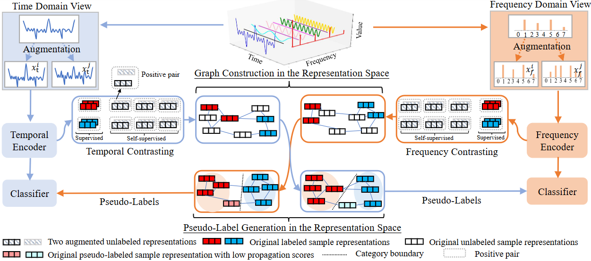

# CompleMatch: Boosting Time-Series Semi-supervised Classification with Temporal-Frequency Complementarity

This repository contains the training code for our paper *"CompleMatch: Boosting Time-Series Semi-supervised Classification with Temporal-Frequency Complementarity"*.

---

## 🧭 Abstract

Time series Semi-Supervised Classification (SSC) aims to improve model performance by utilizing abundant unlabeled data in scenarios where labeled samples are limited. Previous approaches mainly focus on exploiting temporal dependencies within the time domain for SSC. However, these temporal dependencies are susceptible to sampling noise and may not effectively capture the global periodicity of features across categories. To this end, we propose a time series SSC framework called CompleMatch, leveraging the complementary information from both temporal and frequency representations for unlabeled data learning. CompleMatch simultaneously trains two deep neural networks based on time-domain and frequency-domain views, with pseudo-labels generated via label propagation in the representation space guiding the training of the opposing view's classifier. In this co-training paradigm, we incorporate a constraint term to harness the complementary nature of temporal-frequency representations, thereby enhancing the model's robustness under limited labeled data.
In addition, we design a temporal-frequency contrastive learning module that integrates supervised and self-supervised signals to enhance pseudo-label quality by learning more discriminative representations. Extensive experiments demonstrate that CompleMatch surpasses state-of-the-art methods. Furthermore, analyses of model behavior (i.e., ablation studies and visualization) underscore the effectiveness of our proposed approach. 

<p align="center">
  
</p>

---
## 📂 Datasets

The datasets used in this study are as follows:

* **UCR Univariate Archive:** [https://www.cs.ucr.edu/~eamonn/time_series_data_2018/](https://www.cs.ucr.edu/~eamonn/time_series_data_2018/)
  * To ensure stable evaluation, we limit the average number of samples in each category to at least 30. Therefore, 106 datasets from the original 128 UCR datasets are used for experiments.

* **10 Real-World Datasets:**  
  * The HAR, Sleep-EDF, and Epilepsy datasets can be accessed via **Google Drive**: [https://drive.google.com/drive/folders/1waFBtwNtcJYST-8pAqxgMaeqeyuXoqcO?usp=sharing](https://drive.google.com/drive/folders/1waFBtwNtcJYST-8pAqxgMaeqeyuXoqcO?usp=sharing)  
  * The remaining seven datasets are available through the UCR Archive.

* **UEA Multivariate Archive:** [http://www.timeseriesclassification.com/dataset.php](http://www.timeseriesclassification.com/dataset.php)  
  * Most UEA datasets are either small in sample size or short in sequence length. We selected datasets based on two criteria:  
    1. Long sequences with total samples greater than 350, resulting in **EthanolConcentration** (length 1751), **MOTOTLImagery** (length 3000), and **SelfRegulationSCP2** (length 1152).  
    2. Large sample sizes with sequence length greater than 60, resulting in **FaceDetection** (9414 samples) and **SpokenArabicDigits** (8798 samples).  
  * In total, five datasets from the original 30 UEA datasets are selected for experimental analysis.

---

## ⏱ Time and Frequency Augmentation

The `ts_augmentation` folder contains the following scripts:

* `augmentation_time.py` – 18 time-domain data augmentation methods  
* `augmentation_frequency.py` – 7 frequency-domain data augmentation methods  

Additionally, `utils/aug_utils.py` provides utility functions demonstrating how to apply these time- and frequency-domain augmentations for the CompleMatch model in time-series semi-supervised classification.

---

## 🚀 Usage

### Training on a UCR Univariate Dataset

To train a CompleMatch model on a univariate UCR dataset:

```bash
python main_comple_match_uni_ucr.py --labeled_ratio 0.10 --your_args_here
```

For all available arguments and detailed usage, refer to [`main_comple_match_uni_ucr.py`](main_comple_match_uni_ucr.py).

### Training on a Ten Real-World Dataset (e.g., HAR)

To train a CompleMatch model on a ten real-world dataset:

```bash
python main_comple_match_ten.py --labeled_ratio 0.05 --your_args_here
```

For all available arguments and detailed usage, refer to [`main_comple_match_ten.py`](main_comple_match_ten.py).


### Training on a Multivariate UEA Dataset

To train a CompleMatch model on a multivariate UEA dataset:

```bash
python main_comple_match_multi_uea.py --labeled_ratio 0.1 --your_args_here
```

For all available arguments and detailed usage, refer to [`main_comple_match_multi_uea.py`](main_comple_match_multi_uea.py).
